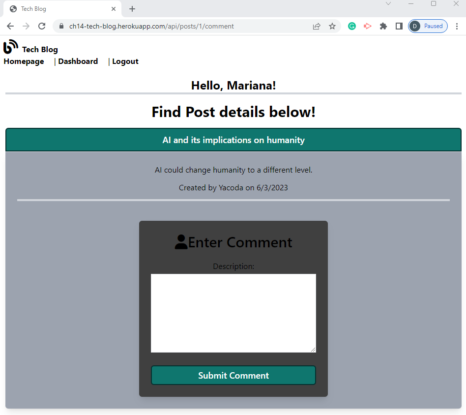

# Model-View-Controller (MVC): CMS-style Tech Blog

## Description
CMS-style Tech Blog is a site where developers can publish their blog posts and comment on other developers’ posts as well. The application follows the MVC folder organization paradigm.

  

## Table of Contents
- [Installation](#installation)
- [UserStory](#userstory)
- [Credits](#credits)
- [Tests](#tests)
- [Email](#email)
- [GitHub](#github)
- [License](#license)
- [DeployedURL](#deployedurl)

## Installation
Clone to your local computer the tech-blog application located in my remote repository at https://github.com/dimartoro/ch14-tech-blog.git Open your Windows CMD in your local computer and write CD until your CMD displays the directory ch14-tech-blog. At the database level run mysql, Squema and database (tech_db), run at the root level to create the tables and the session (npm start) , seed the tables (npm run seed), css_tailwind (npm run dev) and finally run the application (npm start). The application is deployed in Heroku, below you'll find the deployed URL and will be able to enjoy the functionality of my CMS-style Tech Blog.

## UserStory
AS A developer who writes about tech  
I WANT a CMS-style blog site  
SO THAT I can publish articles, blog posts, and my thoughts and opinions   
  
GIVEN a CMS-style blog site  
WHEN I visit the site for the first time  
THEN I am presented with the homepage, which includes existing blog posts if any have been posted;   navigation links for the homepage and the dashboard; and the option to log in  
WHEN I click on the homepage option  
THEN I am taken to the homepage  
WHEN I click on any other links in the navigation  
THEN I am prompted to either sign up or sign in  
WHEN I choose to sign up  
THEN I am prompted to create a username and password  
WHEN I click on the sign-up button  
THEN my user credentials are saved and I am logged into the site  
WHEN I revisit the site at a later time and choose to sign in  
THEN I am prompted to enter my username and password  
WHEN I am signed in to the site  
THEN I see navigation links for the homepage, the dashboard, and the option to log out  
WHEN I click on the homepage option in the navigation  
THEN I am taken to the homepage and presented with existing blog posts that include the post title   and the date created  
WHEN I click on an existing blog post  
THEN I am presented with the post title, contents, post creator’s username, and date created for   that post and have the option to leave a comment  
WHEN I enter a comment and click on the submit button while signed in  
THEN the comment is saved and the post is updated to display the comment, the comment creator’s   username, and the date created  
WHEN I click on the dashboard option in the navigation  
THEN I am taken to the dashboard and presented with any blog posts I have already created and the   option to add a new blog post  
WHEN I click on the button to add a new blog post  
THEN I am prompted to enter both a title and content for my blog post  
WHEN I click on the button to create a new blog post    
THEN the title and contents of my post are saved and I am taken back to an updated dashboard with my   new blog post  
WHEN I click on one of my existing posts in the dashboard  
THEN I am able to delete or update my post and taken back to an updated dashboard  
WHEN I click on the logout option in the navigation  
THEN I am signed out of the site  
WHEN I am idle on the site for more than a set time  
THEN I am able to view posts and comments but I am prompted to log in again before I can add,   update, or delete posts  

## Credits
https://ultimatesecurity.pro/post/same-site-cookie/  
https://devcenter.heroku.com/articles/git#deploy-your-code  
https://courses.bootcampspot.com/courses/3100/assignments/48734?module_item_id=890848  
https://devcenter.heroku.com/articles/jawsdb

## Tests
Accomplishing the user criteria will successfully test the application.    
P1. ERM:  
    
P2. Tech Blog:    
  
P3. Signup:  
  
P4. Login:  
  
P5. Homepage:  
  
P6. Post and Comments:  
  
P7. Enter a Comment:    
  
P8. Dashboard:  
  
P9. Create New Post:  
  
P10. Edit, Save, Cancel, Delete Post:  
  
P11. New Post Created:  
  
P12. Edited Post:  
  
P13. Homepage with New Post:  
    

## Email
Contact me with additional questions at this email address:

dimartoro@gmail.com

## GitHub
https://github.com/dimartoro

## License
This app is licensed under [MIT](https://choosealicense.com/licenses/mit/) license

## DeployedURL
https://ch14-tech-blog.herokuapp.com/

